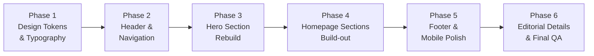

# VISUAL IMPLEMENTATION CHECKLIST — Aleyra Bakehouse

> **Derived from:** `docs/VISUAL-GAP-AUDIT.md`
> **Reference:** `assets-source/references/UIUX AleyraBakehouse V_3.webp`
> **Date:** 2026-07-21
> **Rule:** No code changes until each phase is explicitly approved.

---

## Overview

The rebuild is divided into **6 controlled phases**, ordered by dependency and visual impact. Each phase produces a testable, visually verifiable increment.

**Phase dependency chain:**

---

## Phase 1 — Design Tokens & Typography Foundation

> **Goal:** Align the CSS design system with the reference before touching components.
> **Risk:** Low — changes token values and base styles only.

### Checklist

- [ ] **1.1** Adjust `--color-background` from `#FFFBF5` to `#FFF3D6` (butter-cream as dominant page background)
- [ ] **1.2** Update `--spacing-section` from `5rem` to `6rem`, `--spacing-section-mobile` from `3rem` to `4rem`
- [ ] **1.3** Reduce `--shadow-soft` to `0 1px 4px rgba(93,58,41,0.04)`
- [ ] **1.4** Reduce `--shadow-card` to `0 2px 8px rgba(93,58,41,0.06)`
- [ ] **1.5** Adjust `.card` border-radius from `--radius-xl` (1rem) to `--radius-lg` (0.75rem)
- [ ] **1.6** Reduce `.card` border to `border-color: rgba(220,200,176,0.3)` or remove
- [ ] **1.7** Remove `translateY` hover on `.card:hover` — use subtle shadow change only
- [ ] **1.8** Reduce `.btn-primary` / `.btn-secondary` padding to `0.75rem 1.5rem`
- [ ] **1.9** Remove `translateY` on `.btn-primary:hover` — use color change only
- [ ] **1.10** Change `.eyebrow` color from `cherry-red` to `cocoa-brown`
- [ ] **1.11** Reduce desktop heading scale: `h1` to `5xl` max, `h2` to `4xl` max
- [ ] **1.12** Consider adding `Lora` as body font option (PRD allows "Lora atau Manrope")
- [ ] **1.13** Adjust `.section-container` max-width from `1280px` to `1200px`
- [ ] **1.14** Increase desktop side padding from `4rem` to `5rem`
- [ ] **1.15** Define alternating section background utility classes: `.bg-section-primary` (butter-cream), `.bg-section-secondary` (warm-white), `.bg-section-tertiary` (warm-beige)

### Files affected

| File | Action |
|---|---|
| [globals.css](file:///d:/WARKAI.CO/PROJECT%20WARKAI/WEBSITE/DEPLOY%20WEB/aleyrabakehouse-web/warkai-id-aleyrabakehouse-web/app/globals.css) | Modify tokens, base styles, utilities |
| [layout.tsx](file:///d:/WARKAI.CO/PROJECT%20WARKAI/WEBSITE/DEPLOY%20WEB/aleyrabakehouse-web/warkai-id-aleyrabakehouse-web/app/layout.tsx) | Possibly add Lora font import |

### Verification

- [ ] Visual regression: page background is warm golden butter-cream
- [ ] Buttons, cards, shadows appear softer and more refined
- [ ] No layout shifts or broken spacing

---

## Phase 2 — Header & Navigation

> **Goal:** Replace text logo with brand image, fix nav styling, remove glassmorphism.
> **Risk:** Medium — logo image must render correctly at all sizes.

### Checklist

- [ ] **2.1** Replace text logo with `<Image src="/images/brand/logo-transparent.webp" />` at ~40px height
- [ ] **2.2** Remove `backdrop-blur-md` and `bg-warm-white/80`; use solid `bg-warm-white`
- [ ] **2.3** Remove or soften `border-b border-light-taupe` to `border-light-taupe/20`
- [ ] **2.4** Increase header height from `h-16` to `h-[72px]` or `h-20`
- [ ] **2.5** Change nav font-weight from `font-semibold` to `font-medium`
- [ ] **2.6** Add `tracking-wide` (letter-spacing) to nav links
- [ ] **2.7** Reduce nav `gap-8` to `gap-6`
- [ ] **2.8** Change "Order Now" from `btn-primary` to outlined pill style (`btn-secondary` variant)
- [ ] **2.9** Ensure logo image has proper `alt` text: "Aleyra Bakehouse"
- [ ] **2.10** Test mobile header: logo image renders at correct size, hamburger icon positions correctly
- [ ] **2.11** Refine mobile nav overlay: consider slide-down panel instead of full-screen takeover

### Files affected

| File | Action |
|---|---|
| [header.tsx](file:///d:/WARKAI.CO/PROJECT%20WARKAI/WEBSITE/DEPLOY%20WEB/aleyrabakehouse-web/warkai-id-aleyrabakehouse-web/components/layout/header.tsx) | Rebuild header layout and logo |
| [mobile-navigation.tsx](file:///d:/WARKAI.CO/PROJECT%20WARKAI/WEBSITE/DEPLOY%20WEB/aleyrabakehouse-web/warkai-id-aleyrabakehouse-web/components/layout/mobile-navigation.tsx) | Refine overlay behavior |
| [globals.css](file:///d:/WARKAI.CO/PROJECT%20WARKAI/WEBSITE/DEPLOY%20WEB/aleyrabakehouse-web/warkai-id-aleyrabakehouse-web/app/globals.css) | Possibly add nav-specific styles |

### Verification

- [ ] Logo image renders crisply at all breakpoints
- [ ] "Order Now" is clearly differentiated from nav text (outline style)
- [ ] No glassmorphism effect visible
- [ ] Mobile hamburger and logo are correctly spaced

---

## Phase 3 — Hero Section Rebuild

> **Goal:** Restructure hero from full-bleed overlay to split-layout matching reference.
> **Risk:** High — complete layout restructure. Requires careful responsive handling.
> **Dependency:** Phase 1 (design tokens) and Phase 2 (header height) must be completed first.

### Checklist

- [ ] **3.1** Restructure hero to two-column grid: `grid-cols-1 lg:grid-cols-2`
- [ ] **3.2** Left column: light background (butter-cream), left-aligned text
- [ ] **3.3** Right column: hero image with natural edges, `object-cover` within contained area
- [ ] **3.4** Remove ALL dark gradient overlays (`bg-gradient-to-t`, `bg-black/20`)
- [ ] **3.5** Change eyebrow from "Aleyra Bakehouse" to "MADE WITH LOVE" with heart icon
- [ ] **3.6** Keep PRD headline ("Soft inside. Burnt just right.") — PRD is content authority
- [ ] **3.7** Change headline color from white to `cocoa-brown` / `deep-cocoa`
- [ ] **3.8** Change body copy color from `warm-white/90` to `cocoa-brown/80`
- [ ] **3.9** Align all text left: `text-left items-start`
- [ ] **3.10** Update CTAs: "Order Now" (cocoa-brown filled pill) + "Explore Menu" (outline pill)
- [ ] **3.11** Remove or relocate the Dancing Script tagline from hero
- [ ] **3.12** Add "FIND US THIS WEEKEND" mini event card in the bottom-right of hero area
- [ ] **3.13** Add decorative pagination dots below hero image
- [ ] **3.14** Reduce hero height from `h-[90vh]` to `min-h-[500px] lg:h-[75vh]`
- [ ] **3.15** Mobile: stack layout — image on top, text content below, left-aligned
- [ ] **3.16** Evaluate hero image: current `product-lifestyle.webp` has doodles; reference shows clean editorial photo. May need to crop or source alternate image.

### Files affected

| File | Action |
|---|---|
| [hero-section.tsx](file:///d:/WARKAI.CO/PROJECT%20WARKAI/WEBSITE/DEPLOY%20WEB/aleyrabakehouse-web/warkai-id-aleyrabakehouse-web/components/sections/hero-section.tsx) | Complete rewrite |
| [globals.css](file:///d:/WARKAI.CO/PROJECT%20WARKAI/WEBSITE/DEPLOY%20WEB/aleyrabakehouse-web/warkai-id-aleyrabakehouse-web/app/globals.css) | Add hero-specific utility classes if needed |
| NEW: `components/sections/hero-event-card.tsx` | Mini event info card component |

### Verification

- [ ] Hero renders as split-layout on desktop (text left, image right)
- [ ] Hero stacks on mobile (image top, text bottom)
- [ ] No dark overlays visible
- [ ] Text is dark on light background, fully readable
- [ ] "Find Us This Weekend" card appears correctly
- [ ] Responsive test at 360px, 375px, 768px, 1024px, 1440px

---

## Phase 4 — Homepage Sections Build-out

> **Goal:** Implement all missing homepage sections per PRD and reference visual rhythm.
> **Risk:** High — significant new component work. Must match editorial rhythm of reference.
> **Dependency:** Phases 1–3 must be completed.

### Sub-phase 4A — Signature Products (Restyle)

- [ ] **4A.1** Restructure homepage products from 3-col grid to horizontal scrollable "Best Seller" row
- [ ] **4A.2** Change product card images from `aspect-[4/3]` to `aspect-square` (1:1)
- [ ] **4A.3** Reduce product card content: name + price below image, no full description
- [ ] **4A.4** Replace full-width "Order via WhatsApp" with compact "DETAIL" or small outlined button
- [ ] **4A.5** Add section eyebrow: "BEST SELLER" or "SIGNATURE CREATIONS"
- [ ] **4A.6** Apply alternating section background (warm-white)

### Sub-phase 4B — Brand Story Section (NEW)

- [ ] **4B.1** Create `components/sections/brand-story-section.tsx`
- [ ] **4B.2** Implement two-column layout: left text (headline + body + CTA "READ MORE"), right image
- [ ] **4B.3** Headline: "Our Story" or PRD "A little bakehouse for meaningful moments."
- [ ] **4B.4** Body: short excerpt from brand story
- [ ] **4B.5** CTA: "READ MORE" text link → `/our-story`
- [ ] **4B.6** Apply alternating section background (butter-cream or warm-beige)

### Sub-phase 4C — Brand Values Section (NEW)

- [ ] **4C.1** Create `components/sections/brand-values-section.tsx`
- [ ] **4C.2** Display 4 values: Premium Ingredients, Homemade with Love, Fresh by Order, Perfect for Every Moment
- [ ] **4C.3** Use Lucide line icons matching reference style (heart, leaf, flame, gift)
- [ ] **4C.4** Layout: horizontal row on desktop, 2×2 grid on mobile

### Sub-phase 4D — Upcoming Events Section (NEW)

- [ ] **4D.1** Create `components/sections/events-section.tsx`
- [ ] **4D.2** Event cards with: name, location, date, time, "SEE MAP" button
- [ ] **4D.3** Use dummy event data from `content/events.ts`
- [ ] **4D.4** "SEE ALL EVENTS" link below cards
- [ ] **4D.5** Match reference card proportions: compact cards with subtle styling

### Sub-phase 4E — "Apa Kata Mereka" Section (NEW — adapted from Journal visual slot)

> **Important:** This section adapts the Journal page's editorial visual rhythm into a testimonial section.

- [ ] **4E.1** Create `components/sections/testimonial-section.tsx`
- [ ] **4E.2** Headline: "Apa Kata Mereka"
- [ ] **4E.3** Eyebrow: "REAL WORDS, SWEET MOMENTS"
- [ ] **4E.4** Supporting copy: "Cerita kecil dari mereka yang pernah membawa Aleyra pulang."
- [ ] **4E.5** Implement horizontal swipe carousel for testimonial screenshots
- [ ] **4E.6** Add editorial pull-quote block with oversized quotation mark (adapted from Journal page styling)
- [ ] **4E.7** Lazy load testimonial images outside viewport
- [ ] **4E.8** Use `content/testimonials.ts` for data
- [ ] **4E.9** Add lightbox for click-to-open
- [ ] **4E.10** Preserve Journal page's visual rhythm: generous spacing, editorial typography, warm tones

### Sub-phase 4F — Instagram Gallery Section (NEW)

- [ ] **4F.1** Create `components/sections/instagram-section.tsx`
- [ ] **4F.2** "AS SEEN ON INSTAGRAM" eyebrow
- [ ] **4F.3** 6–8 curated images in responsive grid
- [ ] **4F.4** Each item links to Instagram
- [ ] **4F.5** Lazy-loaded images
- [ ] **4F.6** Match reference grid proportions

### Sub-phase 4G — Gifting / Packaging Section (NEW)

- [ ] **4G.1** Create `components/sections/gifting-section.tsx`
- [ ] **4G.2** "GIFTING MADE SPECIAL" heading
- [ ] **4G.3** Show packaging photography
- [ ] **4G.4** "VIEW PACKAGING" CTA
- [ ] **4G.5** Brief description of gifting experience

### Sub-phase 4H — Seasonal / Pre-Order Section (NEW)

- [ ] **4H.1** Create `components/sections/seasonal-section.tsx`
- [ ] **4H.2** Show open PO status, schedule, product, CTA
- [ ] **4H.3** Use dummy data, easily replaceable

### Sub-phase 4I — Final WhatsApp CTA Section (NEW)

- [ ] **4I.1** Create `components/sections/cta-section.tsx`
- [ ] **4I.2** Headline per PRD: "Your cheesecake moment is one chat away."
- [ ] **4I.3** Body per PRD: "Mau self-reward, gifting, atau dibawa ke acara? Ceritain kebutuhanmu ke Aleyra."
- [ ] **4I.4** CTA: "Chat Aleyra on WhatsApp"
- [ ] **4I.5** Warm background, centered layout

### Sub-phase 4J — Homepage Assembly

- [ ] **4J.1** Update `app/page.tsx` to include all sections in correct order:
  1. `<HeroSection />`
  2. `<ProductSection />` (Best Seller / Signature)
  3. `<BrandStorySection />`
  4. `<BrandValuesSection />`
  5. `<SeasonalSection />`
  6. `<EventsSection />`
  7. `<TestimonialSection />` (Apa Kata Mereka)
  8. `<InstagramSection />`
  9. `<GiftingSection />`
  10. `<CtaSection />`
- [ ] **4J.2** Apply alternating section backgrounds throughout
- [ ] **4J.3** Add thin `light-taupe` dividers between sections where appropriate
- [ ] **4J.4** Test full-page scroll for editorial rhythm and visual flow

### Files affected

| File | Action |
|---|---|
| [product-section.tsx](file:///d:/WARKAI.CO/PROJECT%20WARKAI/WEBSITE/DEPLOY%20WEB/aleyrabakehouse-web/warkai-id-aleyrabakehouse-web/components/sections/product-section.tsx) | Major restyle |
| [page.tsx](file:///d:/WARKAI.CO/PROJECT%20WARKAI/WEBSITE/DEPLOY%20WEB/aleyrabakehouse-web/warkai-id-aleyrabakehouse-web/app/page.tsx) | Add all sections |
| NEW: 8+ section component files | Create |
| NEW: `content/testimonials.ts` | Create if not existing |
| [events.ts](file:///d:/WARKAI.CO/PROJECT%20WARKAI/WEBSITE/DEPLOY%20WEB/aleyrabakehouse-web/warkai-id-aleyrabakehouse-web/content/events.ts) | May need updates |

### Verification

- [ ] Full homepage scroll matches reference editorial rhythm
- [ ] Each section uses correct alternating background
- [ ] All sections render responsively at all breakpoints
- [ ] Carousel functionality works on touch devices
- [ ] No horizontal overflow on any viewport size

---

## Phase 5 — Footer & Mobile Polish

> **Goal:** Rebuild footer to match reference compact bar. Implement mobile-specific features.
> **Risk:** Medium — footer restructure + new mobile components.
> **Dependency:** Phases 1–4 must be completed.

### Checklist

- [ ] **5.1** Restructure footer from 3-column grid to compact single-row bar
- [ ] **5.2** Left: Logo image (light/inverted version or transparent on dark bg)
- [ ] **5.3** Center: "Made with Love ♡" in Dancing Script
- [ ] **5.4** Right: `@aleyra.bakehouse` + Instagram icon + TikTok icon
- [ ] **5.5** Move detailed contact info and page links to Visit Us page or pre-footer section
- [ ] **5.6** Reduce footer vertical padding
- [ ] **5.7** Add copyright line below main footer bar in smaller text
- [ ] **5.8** Implement sticky WhatsApp CTA at bottom of viewport for mobile
- [ ] **5.9** Add `env(safe-area-inset-bottom)` for bottom-safe spacing on mobile
- [ ] **5.10** Ensure sticky WhatsApp does not overlap content or footer
- [ ] **5.11** Test mobile nav overlay: slide-down behavior, focus trap, escape key close

### Files affected

| File | Action |
|---|---|
| [footer.tsx](file:///d:/WARKAI.CO/PROJECT%20WARKAI/WEBSITE/DEPLOY%20WEB/aleyrabakehouse-web/warkai-id-aleyrabakehouse-web/components/layout/footer.tsx) | Complete rewrite |
| [mobile-navigation.tsx](file:///d:/WARKAI.CO/PROJECT%20WARKAI/WEBSITE/DEPLOY%20WEB/aleyrabakehouse-web/warkai-id-aleyrabakehouse-web/components/layout/mobile-navigation.tsx) | Refinements |
| NEW: `components/layout/sticky-whatsapp.tsx` | Create |
| [layout.tsx](file:///d:/WARKAI.CO/PROJECT%20WARKAI/WEBSITE/DEPLOY%20WEB/aleyrabakehouse-web/warkai-id-aleyrabakehouse-web/app/layout.tsx) | Add sticky WhatsApp component |

### Verification

- [ ] Footer renders as compact bar with logo + script + social icons
- [ ] Sticky WhatsApp CTA is visible on mobile, positioned correctly
- [ ] Bottom-safe spacing prevents content from being hidden behind system UI
- [ ] Footer is visually balanced at all breakpoints

---

## Phase 6 — Editorial Details & Final QA

> **Goal:** Add all decorative/editorial elements and perform final visual QA against reference.
> **Risk:** Low — polish pass on existing structures.
> **Dependency:** All previous phases completed.

### Checklist

- [ ] **6.1** Redesign `.divider-heart` to simpler thin rule + small decorative element (not heavy heart pattern)
- [ ] **6.2** Add editorial pull-quote component with oversized quotation mark for testimonials
- [ ] **6.3** Add decorative botanical/vintage illustration accents where appropriate (from brand assets)
- [ ] **6.4** Verify all section backgrounds alternate correctly
- [ ] **6.5** Verify all text colors are correct (dark on light, no white-on-dark except footer)
- [ ] **6.6** Verify all CTA buttons use correct variant (filled vs. outline) per context
- [ ] **6.7** Add hover states: color transitions (no translateY), subtle scale on images
- [ ] **6.8** Verify Dancing Script usage: hero eyebrow, footer tagline, brand moments only
- [ ] **6.9** Verify Lucide icons are used consistently and at correct sizes
- [ ] **6.10** Test reduced-motion preferences — all animations gracefully degrade
- [ ] **6.11** Test keyboard navigation — all interactive elements are reachable and have focus styles
- [ ] **6.12** Run Lighthouse audit — target: Performance ≥90, Accessibility ≥90, SEO ≥95
- [ ] **6.13** Cross-browser test: Chrome, Firefox, Safari, Edge
- [ ] **6.14** Mobile viewport test: 360px, 375px, 390px, 430px, 768px, 1024px, 1440px
- [ ] **6.15** Verify no horizontal overflow at any viewport size
- [ ] **6.16** Screenshot comparison: final implementation vs. reference at key viewports
- [ ] **6.17** Verify all images use `next/image` with proper `alt`, `sizes`, and lazy loading
- [ ] **6.18** Verify no unused CSS tokens or styles remain from pre-audit implementation

### Files affected

| File | Action |
|---|---|
| [globals.css](file:///d:/WARKAI.CO/PROJECT%20WARKAI/WEBSITE/DEPLOY%20WEB/aleyrabakehouse-web/warkai-id-aleyrabakehouse-web/app/globals.css) | Final polish |
| All component files | Final pass |
| NEW: decorative components if needed | Create |

### Verification

- [ ] Side-by-side screenshot comparison against reference at:
  - Mobile (375px)
  - Tablet (768px)
  - Desktop (1440px)
- [ ] All Lighthouse scores meet targets
- [ ] No accessibility violations
- [ ] No visual regressions from previous phases

---

## Notes & Constraints

> [!IMPORTANT]
> - **Do not modify `assets-source/`** — copy optimized assets to `public/` only.
> - **Do not modify `doc/PRD.md`** — it is the content source of truth.
> - **PRD content takes precedence** over reference for text, routes, and business rules.
> - **Reference takes precedence** for visual layout, spacing, proportions, and styling.
> - **Journal → "Apa Kata Mereka"** adaptation must preserve editorial visual rhythm from the Journal page layout in the reference.
> - Each phase requires **explicit approval** before starting.
> - Each phase should end with a **verifiable visual checkpoint**.
